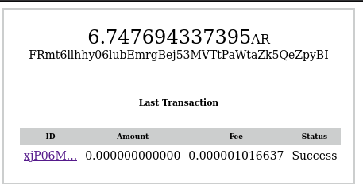

# React AR Wallet

A simple and reusable Arweave Wallet component for React



## Installation

The package can be installed via [npm](https://github.com/npm/cli):

```
npm install react-ar-wallet --save
```

Or via [yarn](https://github.com/yarnpkg/yarn):

```
yarn add react-ar-wallet
```

You’ll need to install React separately since those dependencies aren’t included in the package. 

```js
import React, { useState } from "react";
import ArWallet from "react-ar-wallet";

const Example = () => {
  const [wallet, setWallet] = useState('3oDgWphQ0m6D5lIBaN9ebDIdznwsH6J-0kT04dpBWiQ');
  return (
    <ArWallet wallet={wallet} />
  );
};
```

## Configuration

The most basic use of the DatePicker can be described with:

```js
<ArWallet wallet={wallet} />
```


